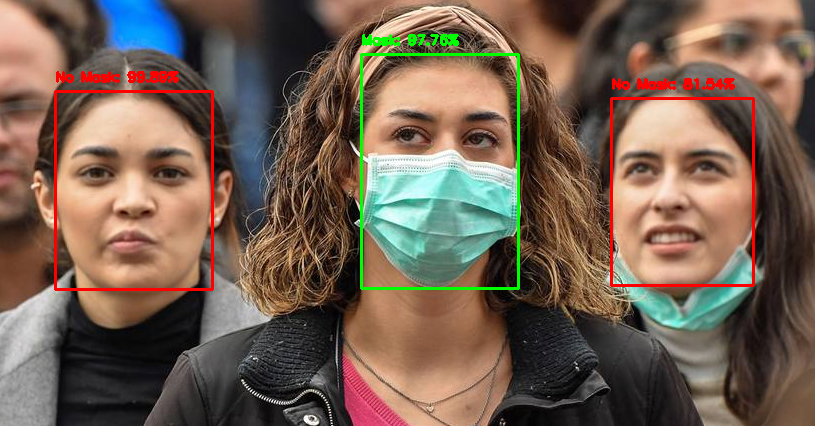

# Face Mask Detection with a Real-Time Alert System

This repository contains the code and resources for a real-time face mask detection and warning system. The project utilizes computer vision techniques and deep learning models to detect whether a person is wearing a face mask or not. Additionally, it includes an alert system by BrainPad Pulse microcomputer to notify individuals not wearing masks, promoting safety measures in public spaces.

## Features

- Face Detection: It employs a pre-trained deep learning model for detecting faces in images. The face detection model used in this code is based on the Single Shot MultiBox Detector (SSD) framework with a MobileNetV2 architecture.
- Mask Detection: After detecting faces, the code uses another pre-trained deep learning model to classify whether each detected face is wearing a mask or not. This mask detection model is loaded using Keras and has been previously trained on a dataset containing images of people with and without masks.
- Deep Neural Networks (DNN): Both the face detection and mask detection models are deep neural networks (DNNs) trained on large datasets to perform their respective tasks.
- Image Preprocessing: Before passing images to the mask detection model, the code preprocesses them by resizing and applying other transformations to ensure compatibility with the model's input requirements.
- Real-time Video Processing: The code continuously captures frames from a video stream, processes them using the face and mask detection models, and displays the results in real-time.
- Feedback via Hardware Interaction: The code integrates with the BrainPad hardware controller to provide feedback when a person is detected without wearing a mask. It toggles the LED and displays a message on the BrainPad's display to prompt the person to wear a mask.

## Instructions

1. Clone this repository:
git clone https://github.com/ShahinHussein/FaceMaskDetection
2. Install required Python libraries: `pip install numpy opencv-python imutils tenserflow keras DUELink`
3. Ensure your webcam is connected and functioning properly.
4. Run the script: `python detect_mask_video.py`
5. Face mask detection will start automatically, with real-time alert provided by BrainPad Pulse microcomputer visually and auditory.

## Hardware

- Webcam or video stream source
- [BrainPad Pulse Microcomputer](https://www.brainpad.com/devices/pulse/)

## Contributing

Contributions to this project are welcome! Feel free to fork this repository, make improvements, and submit pull requests to enhance face mask detection capabilities or improve the alert system.

## Credits

This project was inspired by the desire to test deep learning models and challenging projects using the BrainPad Pulse microcomputer with a USB camera. Special thanks to the developers of the [GHI Electronics](https://www.ghielectronics.com/) and [BrainPad](https://www.brainpad.com/) for providing amazing user-friendly educational microcomputers.